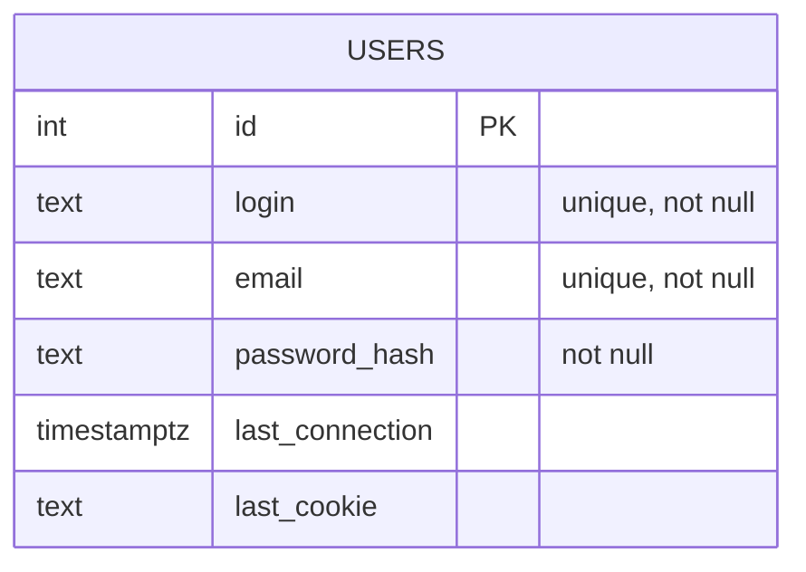

#Transcendance

*This project has been created as part of the 42 curriculum by adoireau, sle-nogu, akassous and wbeschon.*

Projet web **containerisé** organisé en **micro-services**:

- **Frontend**: Next.js (SSR) + React, UI “Arcade Room” (Babylon.js) + pages de jeux.
- **Auth Service**: NestJS + Postgres (users) + Redis (sessions).
- **Game Service**: NestJS (API du jeu Pong).
- **Realtime Gateway**: NestJS + Socket.IO qui connecte le Front au Game Service.
- **Reverse Proxy**: Nginx (template envsubst) + intégration Traefik (prod).
- **Monitoring**: Prometheus + Grafana + Alertmanager + exporters (Node/Postgres/Redis/Nginx).

---

## Team Information

| Membre | Rôle(s) assigné(s) | Responsabilités (résumé) |
|---|---|---|
| **Arthur Doireau** | Tech Lead, DevOps/Infra, Developer | Architecture “jeu temps réel” (Pong + gateway), intégration services, décisions techniques côté backend temps réel. |
| **Sebastien Le nogues** | PO/PM, Developer Frontend | Expérience “Arcade Room”, UI/UX, intégration Next.js, internationalisation, navigation. |
| **Walter Beschon** | Developer Backend (Auth) | Authentification, sessions, intégration Postgres/Redis, endpoints auth. |
| **Amine Kassoussi** | DevOps/Infra, Developer Backend | Monitoring Backend. |

---

## Technical Stack

### Frontend

- **Framework**: Next.js (`services/front`) + React.
- **Temps réel**: `socket.io-client`.
- **3D/Scene**: Babylon.js (`@babylonjs/core`, loaders glTF) + assets `.glb`.
- **Auth côté UI**: cookie httpOnly (`Authentication`) relayé via routes API Next.
- **i18n**: dictionnaire maison (`languageData.ts`) + param `?lang=`.

### Backend

- **Framework**: NestJS (`services/auth`, `services/games`, `services/realtime-gateway`).
- **Auth**:
	- Postgres via driver `pg` (requêtes SQL directes),
	- hash de mot de passe via `bcryptjs`,
	- sessions via Redis (`redis`).
- **Jeu**:
	- API REST Pong (création/join/input/restart/state),
	- logique de simulation en mémoire (tick 60 Hz).
- **Gateway temps réel**:
	- Socket.IO (WebSocket),
	- pont REST ↔ WS + polling (60 Hz) sur l’API du Game Service.

### Base de données (et pourquoi)

- **PostgreSQL**: stockage durable des comptes (table `users`) SQL simple.
- **Redis**: stockage volatile des sessions (cookie → login) avec TTL, choix adapté au **cache/session store** et aux expirations.

### Reverse proxy / déploiement

- **Nginx**: reverse proxy (HTTP + WS), template configuré via variables d’environnement.
- **Docker Compose**: orchestration locale/CI.

### Justification des choix majeurs

- **Micro-services**: séparation des responsabilités (Auth/Jeu/Realtime/Front) et déploiement isolé.
- **Gateway WS dédiée**: simplifie la compatibilité WebSocket côté infra (Nginx/Traefik) et évite de mélanger logique HTTP/WS dans le Game Service.
- **SQL “raw” + table minimale**: itération rapide (schéma court, création au démarrage) pour valider l’auth et la persistance.

## Database Schema

### PostgreSQL: table `users`

Créée automatiquement au démarrage du service `auth`.

- **Table**: `users`
	- **id**: `SERIAL` (PK)
	- **login**: `TEXT UNIQUE NOT NULL`
	- **email**: `TEXT UNIQUE NOT NULL`
	- **password_hash**: `TEXT NOT NULL`
	- **last_connection**: `TIMESTAMPTZ NULL`
	- **last_cookie**: `TEXT NULL` (dernier token de session actif)



### Redis: sessions

- **Clé**: `Authentication` (UUID v4) stocké dans le cookie httpOnly.
- **Valeur**: `login` (string).
- **TTL**: 7 jours (par défaut).

---

## Features List (implémentées)

Attribution basée sur l’historique Git et la localisation du code (approximation, à préciser si besoin).

| Feature | Description | Service(s) |
|---|---|---|
| **Register** | Création d’utilisateur (login/email/password), vérifs d’unicité, hash bcrypt | `auth` + `front` |
| **Login** | Auth par login **ou** email + cookie httpOnly `Authentication` | `auth` + `front` |
| **Logout** | Invalidation session Redis + clear cookie | `auth` + `front` |
| **Auth guard** | Middleware Next qui protège les routes (sauf `/login`) via `/auth/status` | `front` |
| **Arcade Room 3D** | Scene Babylon.js + modèles `.glb` + navigation vers `/play/:gameId` | `front` |
| **Pong (multijoueur)** | Création/join d’un match, input (up/down), scores, fin de partie | `games` |
| **Pong (solo AI)** | Mode solo avec adversaire IA (mouvement + “dead zone”) | `games` | Arthur Doireau |
| **Realtime Gateway** | Socket.IO: `pong:create|solo|join|move|restart|leave` + polling 60Hz et broadcast `pong:state` | `realtime-gateway` |
| **Connection fallback** | Écran d’erreur si WS indisponible (debounce) | `front` |
| **Breakout / Space Invaders** | Pages “placeholder / work in progress” | `front` |

---

## Modules

### Modules choisis et implémentation

| Module | Type | Points | Justification | Implémentation |
|---|---:|---:|---|---|
| **Use a framework for both the frontend and backend** | Major | 2 | Développement modulaire et structuré | Frontend React, Backend NestJS |
| **Implement real-time features using WebSockets or similar technology** | Major | 2 | Essentiel pour le jeu multijoueur en temps réel | Gateway WebSocket avec Socket.IO |
| **Server-Side Rendering (SSR) for improved performance and SEO** | Minor | 1 | Amélioration des performances et de l'expérience utilisateur | Next.js avec SSR |
| **Support for multiple languages** | Minor | 1 | Accessibilité internationale | Système de dictionnaire personnalisé |
| **Support for additional browsers** | Minor | 1 | Compatibilité étendue | Support natif multi-navigateurs |
| **Introduce an AI Opponent for games** | Major | 2 | Permet le jeu en solo | IA Pong de niveau intermédiaire |
| **Implement a complete web-based game** | Major | 2 | Jeu Pong multijoueur complet | Simulation 60 FPS en mémoire, API REST + Gateway WS |
| **Remote players** | Major | 2 | Expérience multijoueur sur appareils séparés | Système de rooms dédiées par partie |
| **Implement advanced 3D graphics** | Major | 2 | Interface immersive en 3D | Babylon.js pour la page d'accueil |
| **Monitoring system with Prometheus and Grafana** | Major | 2 | Surveillance complète des microservices | Microservice de monitoring dédié |
| **Microservices architecture** | Major | 2 | Séparation des responsabilités et stabilité WebSocket | Docker Compose + Nginx avec templates + labels Traefik |
| **Connection error view mode** | Minor | 1 | Expérience utilisateur robuste en cas de défaillance | Détection `connect_error` / `disconnect` + écran dédié |

**Total**: 20 points.

---

## Individual Contributions

Cette section détaille “qui a fait quoi” (approximation basée sur l’historique Git + structure du repo).

### Arthur Doireau

- **Backend Game (`services/games`)**
	- logique Pong (création/join/input, tick 60Hz, scoring, fin, restart),
	- mode solo avec IA.
- **Backend Realtime (`services/realtime-gateway`)**
	- events Socket.IO `pong:*`,
	- bridge WS ↔ REST + polling d’état.
- **Défis & solutions**
	- **Synchronisation**: choix d’un modèle simple (polling 60Hz) pour garantir un état cohérent côté clients sans complexité réseau prématurée.

### Sebastien Le nogues

- **Frontend (`services/front`)**
	- UI globale (Navbar, overlays, pages),
	- “Arcade Room” Babylon.js + modèles 3D,
	- placeholders Breakout/Space Invaders,
	- i18n via dictionnaire,
	- intégration auth côté UI + protection middleware.
- **Défis & solutions**
	- **Perf/UX**: préchargement des assets `.glb`, fallback mobile (liste de jeux au lieu de la scène 3D).

### Walter Beschon

- **Auth Service (`services/auth`)**
	- endpoints auth, stockage Postgres + sessions Redis,
	- gestion “single active session” via `last_cookie`.
- **Défis & solutions**
	- **Sécurité**: hash bcrypt, cookie httpOnly, invalidation de l’ancienne session à chaque login.

### Amine Kassoussi

- **DevOps/Infra & Monitoring**
	- Mise en place du monitoring : Prometheus (scraping et règles), Alertmanager (routes/notifications), Grafana (dashboards et provisioning).
	- Fichiers clés : [monitoring/prometheus/prometheus.yml](monitoring/prometheus/prometheus.yml), [monitoring/prometheus/alerts/transcendance-alerts.yml](monitoring/prometheus/alerts/transcendance-alerts.yml), [monitoring/alertmanager/config.yml](monitoring/alertmanager/config.yml), et les dashboards Grafana dans [monitoring/grafana/dashboards/working-dashboard.json](monitoring/grafana/dashboards/working-dashboard.json).
	- Intégration des services de monitoring dans la composition Docker et assistance au déploiement/local dev.

---

## Run / Dev / Prod

### Prérequis

- Docker + Docker Compose
- Un fichier `.env`

### Variables d’environnement

Le `docker-compose.yml` référence notamment:

- **Proxy/Routes**: `PROXY_NAME`, `DOMAIN`, `FRONT_PATH`, `AUTH_PATH`, `GAMES_PATH`, `WS_PATH`
- **Monitoring (routes)**: `PROMETHEUS_PATH`, `GRAFANA_PATH`, `ALERTMANAGER_PATH`
- **Frontend**: `FRONTEND_NAME`, `FRONTEND_PORT`
- **Auth**: `AUTH_SERVICE_NAME`, `AUTH_PORT`
- **Games**: `GAME_SERVICE_NAME`, `GAME_PORT`
- **Gateway**: `REALTIME_GATEWAY_NAME`, `REALTIME_GATEWAY_PORT`
- **Postgres**: `POSTGRES_HOST`, `POSTGRES_PORT`, `POSTGRES_DB`, `POSTGRES_USER`, `POSTGRES_PASSWORD`
- **Redis**: `REDIS_HOST`, `REDIS_PORT`
- **Monitoring (containers)**: `PROMETHEUS_NAME`, `PROMETHEUS_PORT`, `GRAFANA_NAME`, `GRAFANA_PORT`, `ALERTMANAGER_NAME`, `ALERTMANAGER_PORT`
- **Monitoring (auth basic via Nginx)**: `PROMETHEUS_ADMIN_USER`, `PROMETHEUS_ADMIN_PASSWORD`, `GRAFANA_ADMIN_USER`, `GRAFANA_ADMIN_PASSWORD`, `ALERTMANAGER_ADMIN_USER`, `ALERTMANAGER_ADMIN_PASSWORD`
- **Alertmanager (SMTP)**: `ALERTMANAGER_EMAIL`, `ALERTMANAGER_SMTP_PASSWORD`
- **Node**: `NODE_ENV`

### Lancer le projet

```bash
make build
make up
```

### Arrêter / nettoyer

```bash
make down
make clean
```

---

## Monitoring
- **Prometheus**: `monitoring/prometheus/prometheus.yml` + règles d’alerting dans `monitoring/prometheus/alerts/`
- **Grafana**: provisioning + dashboards dans `monitoring/grafana/` (ex: dashboard `Transcendance - Working Dashboard`)
- **Alertmanager**: routes/receivers dans `monitoring/alertmanager/config.yml` (SMTP requis)

### Accès
- **Prometheus**: `https://localhost:8443/prometheus` (par défaut)
- **Grafana**: `https://localhost:8443/grafana/` (par défaut)
- **Alertmanager**: `https://localhost:8443/alertmanager/` (par défaut)

---

## Endpoints

### Auth service

- `GET /auth/status`
- `POST /auth/register`
- `POST /auth/login`
- `POST /auth/logout`

### Game service (Pong)

- `POST /pong/matches`
- `POST /pong/matches/solo`
- `POST /pong/matches/:matchId/join`
- `POST /pong/matches/:matchId/input`
- `POST /pong/matches/:matchId/restart`
- `POST /pong/matches/:matchId/disconnect`
- `POST /pong/matches/:matchId/close`
- `GET /pong/matches/:matchId/state`

### Realtime gateway (Socket.IO)

- Path dev: `/socket.io`
- Path prod via Nginx: `/ws/socket.io`

Events:

- client → server: `pong:create`, `pong:solo`, `pong:join`, `pong:move`, `pong:restart`, `pong:leave`
- server → client: `pong:state`, `pong:error`, `pong:closed`
